<p align="center">
  

  <h3 align="center">Laravel LaPosta</h3>

  <p align="center">
   social media scheduler
  </p>
</p>

## About The Project
demo project built with laravel to schedule social media posts for later publish .. project focuses on using laravel framework components , architecture, patterns and tests.


## prerequisite
try to make twitter or facebook application with publish permissions
and update tokens in .env file

## Usage

1. Clone the repo

    ```sh
    git clone https://github.com/civilcoder55/laravel-laposta.git
    ```

2. update env file

    ```sh
    cp .env.example .env
    ```

3. start workers

    ```sh
    php artisan queue:work
    ```

    ```sh
    php artisan schedule:work
    ```

    ```sh
    php artisan websockets:serve
    ```

5. start server

    ```sh
    php artisan serve
    ```

6. access website at

    ```sh
    http://127.0.0.1:8000
    ```

## Screenshots

<p align="center">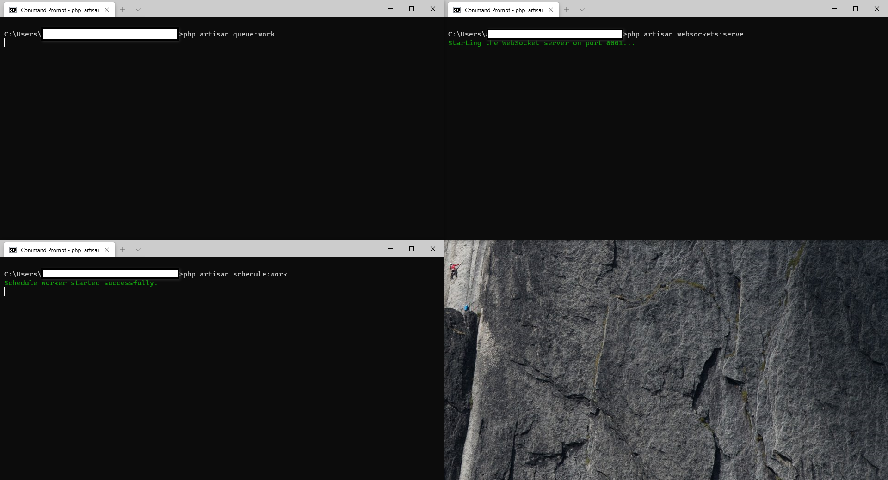</p>
<p align="center">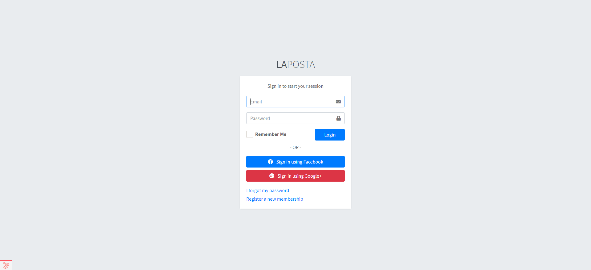</p>
<p align="center">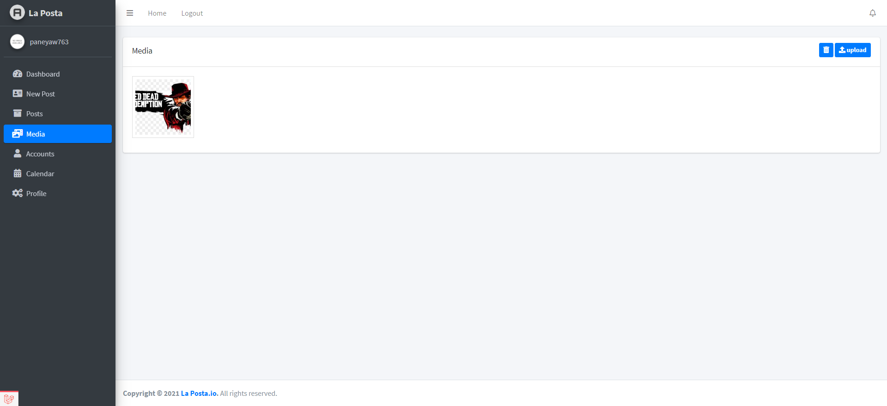</p>
<p align="center">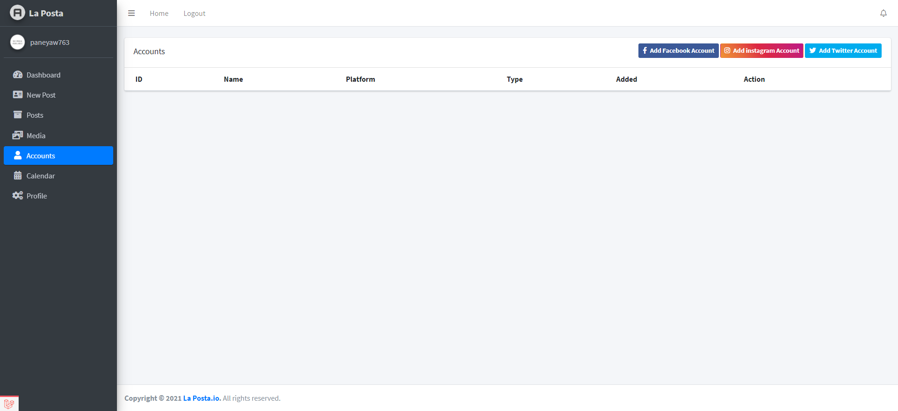</p>
<p align="center">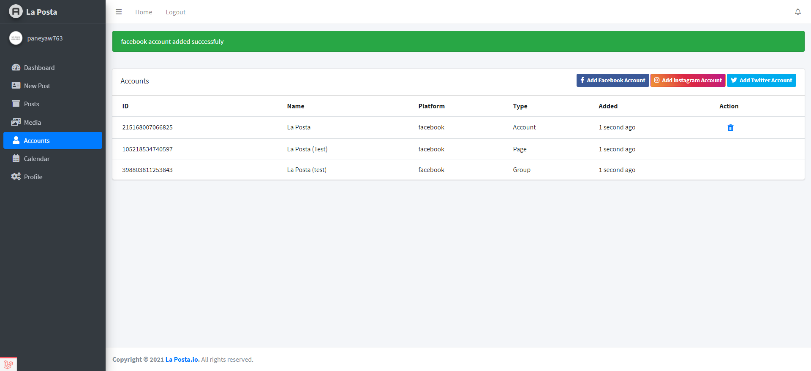</p>
<p align="center">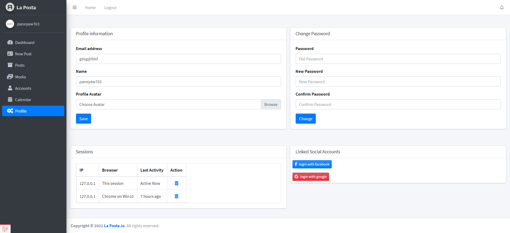</p>
<p align="center">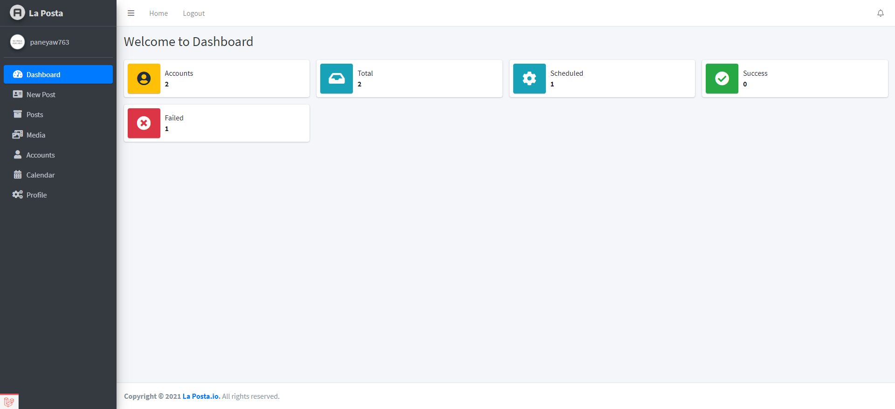</p>
<p align="center">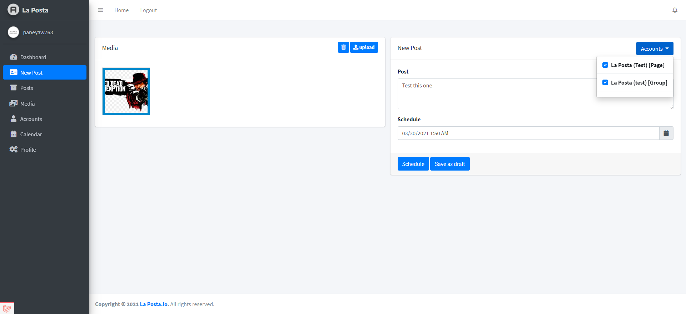</p>
<p align="center">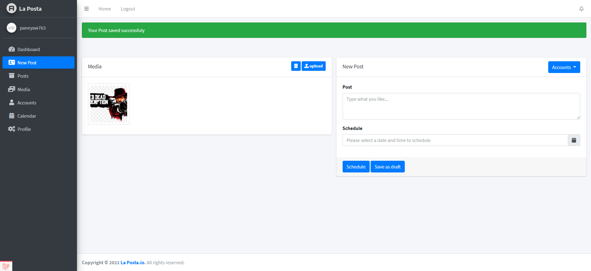</p>
<p align="center">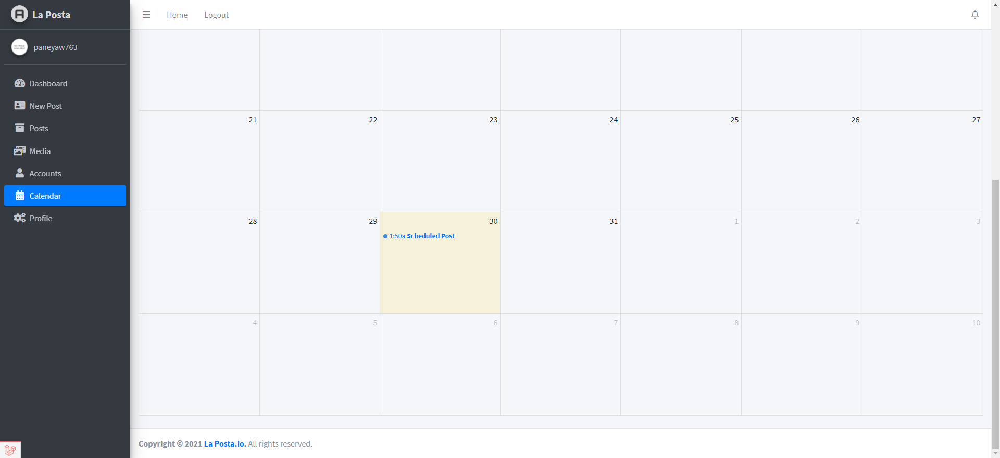</p>
<p align="center">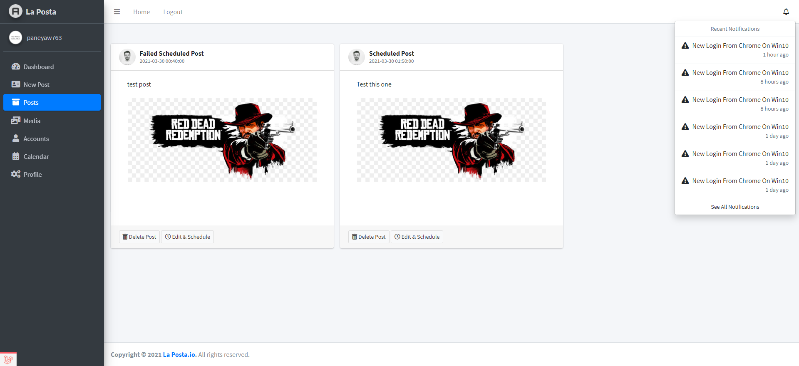</p>
<br>

## Video Preview

-   [Youtube Video](https://www.youtube.com/watch?v=38HfwgmgL-8)

## Built With

-   [Laravel](https://laravel.com)

<!-- GETTING STARTED -->
